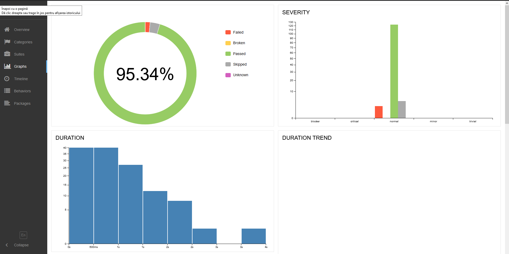

## Installation

Make sure you have **Node v12.x.x** running on your system.

Clone the repository and run `npm i` in repository root.

## Running tests

```sh
./node_modules/.bin/wdio wdio.conf.js
```

#### Running a specific feature:

```sh
./node_modules/.bin/wdio wdio.conf.js --spec features/login.feature
```

#### Workaround for excluding tagged/untagged scenarios - add a hook to hooks.ts with a desired tag expression

Before({tags: 'not @sanity'}, function() {
    return 'skipped';
})

#### Allure reporting part

```sh
npm run report
```

